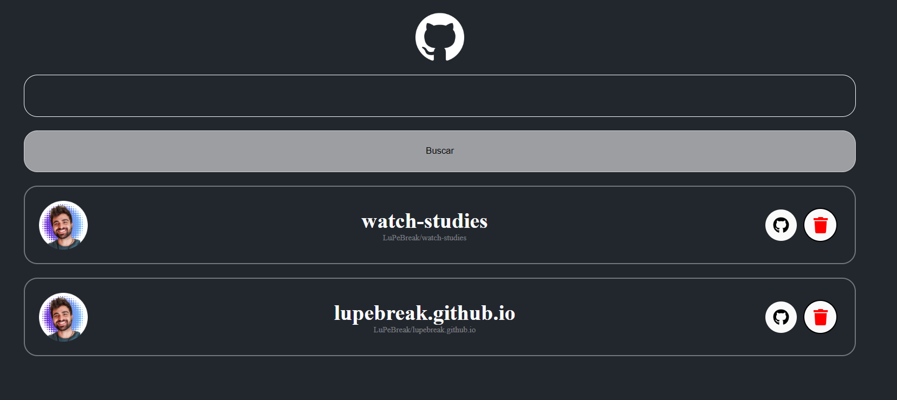

<h1 align="center"> React Github Repositories</h1>

  <a href="#-tecnologias">Tecnologias</a>&nbsp;&nbsp;&nbsp;|&nbsp;&nbsp;&nbsp;
  <a href="#-projeto">Projeto</a>&nbsp;&nbsp;&nbsp;|&nbsp;&nbsp;&nbsp;
  <a href="#memo-licença">Licença</a>

  

 

  

## 🚀 Tecnologias

Esse projeto foi desenvolvido com as seguintes tecnologias:

- Javascript
- React
- Git e Github

## 💻 Projeto

Github Repositories é um projeto para pesquisar e listar repositorios do github de forma simples e organizada

## :memo: Licença

Esse projeto está sob a licença MIT.

---

Feito com ♥ by [LuPeBreak](https://github.com/LuPeBreak/) como um LabProject dos cursos de React da [DIO](https://dio.me/) durante o Bootcamp da Orange Tech - PoweredBy [Github API](https://api.github.com/)
